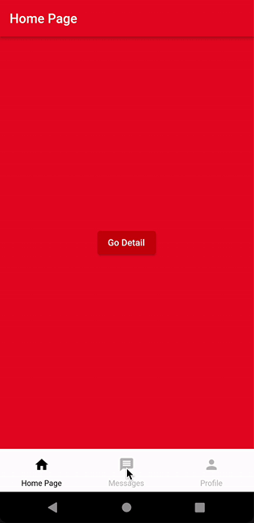

Best bottom bar structure created to control page flow.

## Preview

 

## Features

- [x] As in Instagram logic, when you save only 3 of the previous tabs and press the back button, it
  goes to the previous tab.
- [x] If you are in a tab, it will return to the old page when the back button is clicked.
- [x] If there is a tab you haven't been to before, that tab will be load after you go.

## Important Notes

- [x] The use of initState must be in state management so that the bottom bar pages are not loaded
  directly when the application is opened.
- [x] If you want the bottom navigation bar to stay fixed when you go to another page, set the
  rootNavigator parameter to false.

```
Navigator.of(context,rootNavigator: false).pushNamed(Routes.homePage);
```

## Getting Started

Add Instagram Bottom Navigation Bar to your pubspec.yaml in dependencies: section.

```yaml
dependencies:
  instagram_bottom_nav_bar: ^3.0.10
```

Update dependencies:

```
flutter pub get
```

Import the package:

```
import 'import 'package:instagram_bottom_nav_bar/instagram_tab_view.dart';
```

It also has all the features of the normal bottom navigation bar

```
InstagramTabView(
      selectedItemColor: Colors.black,
      unselectedItemColor: Colors.grey.shade400,
      backgroundColor: Colors.white, // Default is Colors.white
      elevation: 12, // Default elevation is 12,
      showSelectedLabels: true, // Default showSelectedLabels is true,
      showUnselectedLabels: true, // Default showUnselectedLabels is true
      iconSize: 24, // Default iconSize is 24,
      bottomNavigationBarType: BottomNavigationBarType.fixed,
      iconType: IconType.icon,
      items: [
        InstagramTabItem(label: 'Home Page', page: HomePage(), icon: Icon(Icons.add)),
        InstagramTabItem(label: 'Profile', page: Messages(), icon: Icon(Icons.refresh)),
      ],
    )
```


